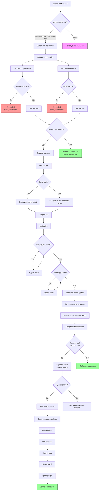

# Объяснение GitLab CI/CD пайплайна

## Стадии пайплайна

Пайплайн состоит из следующих стадий, выполняющихся в указанном порядке:
1. **code-quality** - проверка качества и безопасности кода
2. **package** - сборка и публикация Docker образа
3. **test** - тестирование приложения
4. **deploy-manual** - ручное развертывание в production

## Условия выполнения пайплайна

Пайплайн запускается только для событий, связанных с кодом:
- Merge request события (`$CI_PIPELINE_SOURCE == "merge_request_event"`)
- Наличие ветки или тега (`$CI_COMMIT_BRANCH || $CI_COMMIT_TAG`)
- Во всех остальных случаях пайплайн не запускается (`when: never`)

## Детальное описание job'ов и условий их выполнения

### Стадия code-quality
#### static-security-analysis
- **Стадия**: code-quality
- **Расширяет**: `.python-base`
- **Теги**: course_runner 

**Условия выполнения**:
  - Событие merge request (`$CI_PIPELINE_SOURCE == "merge_request_event"`)
  - Ветка main (`$CI_COMMIT_BRANCH == "main"`)
  - Наличие тега (`$CI_COMMIT_TAG`)
- **Скрипт**:
  - Устанавливает bandit
  - Запускает анализ безопасности и сохраняет результаты в bandit-report.json
  - Если найдено уязвимостей > 0, job завершается с ошибкой
- **Артефакты**: bandit-report.json (хранится 1 неделю)
- **allow_failure**: true (не блокирует пайплайн при падении)

#### static-code-analysis
- **Стадия**: code-quality

- **Расширяет**: `.python-base`
- **Теги**: course_runner
- **Условия выполнения**: такие же как у static-security-analysis
- **Скрипт**:
  - Устанавливает ruff  - Запускает проверку стиля кода и сохраняет результаты в ruff-report.json
  - Считает общее количество проблем и количество ошибок (major severity)
  - Если ошибок > 0, job завершается с ошибкой
- **Артефакты**: 
  - Отчет о качестве кода (ruff-report.json)
  - Сам файл ruff-report.json
  - Хранится 1 неделю
- **allow_failure**: true

### Стадия package

#### package
- **Стадия**: package
- **Расширяет**: `.dind-image`
- **Теги**: course_runner
- **Условия выполнения**:
  - Ветка main (`$CI_COMMIT_BRANCH == "main"`)
  - Наличие тега (`$CI_COMMIT_TAG`)
- **Скрипт**:
  - Пытается pull'ить ранее собранные образы для кеширования
  - Собирает новый Docker образ с тегами:
    - `$WEB_IMAGE_NAME:$CI_COMMIT_SHORT_SHA`
    - `$WEB_IMAGE_NAME:latest`
  - Использует инкрементальную сборку с кешированием
  - Пушит оба тега в реестр
  - Если ветка main, обновляет тег cache-latest
- **Зависимости**: Требует Docker-in-Docker сервиса для сборки образов

### Стадия test

#### testing
- **Стадия**: test
- **Расширяет**: `.python-base`
- **Теги**: course_runner
- **Условия выполнения**:
  - Ветка main (`$CI_COMMIT_BRANCH == "main"`)
  - Наличие тега (`$CI_COMMIT_TAG`)
- **Зависимости**: needs: ["package"] - выполняется только после успешного завершения job'а package
- **Переменные**: Жестко закодированные значения для тестового окружения
- **Сервисы**:
  - PostgreSQL 17-alpine (alias: postgres)
  - Собранный Docker образ приложения (alias: web-test)
- **Скрипт**:
  - Ожидает готовности PostgreSQL
  - Ожидает готовности веб-приложения
  - Устанавливает зависимости для тестирования
  - Запускает pytest с генерацией отчетов:
    - JUnit XML
    - Allure результаты
    - HTML и терминальный отчеты о покрытии кода
- **Артефакты** (always):
  - JUnit отчет (junit.xml)
  - Allure результаты (allure-results/)
  - Отчет о покрытии (coverage-report/)
  - Логи приложения (app/logs/)
  - Хранится 1 неделю
  - **allow_failure**: true

#### generate_and_publish_report
- **Стадия**: test
- **Расширяет**: `.python-base` (те же условия, что и у testing)
- **Теги**: course_runner
- **Зависимости**: needs: [testing] - требует успешного завершения job'а testing
- **Образ**: frankescobar/allure-docker-service:latest
- **Скрипт**:
  - Генерирует HTML отчет из Allure результатов
  - Публикует отчет на GitLab Pages (копирует в директорию public/)
- **Артефакты**:
  - Директория public/ (для GitLab Pages)
  - Хранится 1 неделю
- **Условие**: when: always (выполняется независимо от результата testing)
- **pages**: true (указывает, что это GitLab Pages)

### Стадия deploy-manual

#### deploy-manual
- **Стадия**: deploy-manual
- **Образ**: ubuntu:24.04
- **Теги**: course_runner
- **Когда**: manual (запускается только вручную)
- **Условия выполнения** (из rules):
  - Тег соответствует семантическому версионированию (`$CI_COMMIT_TAG =~ /^v\d+\.\d+\.\d+$/`), т.е. только для продакшн-тегов
- **before_script**:
  - Устанавливает необходимые утилиты (openssh-client, rsync, curl)
  - Настраивает SSH-агент и добавляет приватный ключ  - Добавляет хост развертывания в known_hosts
- **Скрипт**:
  - Создает/обновляет файл .env на целевом сервере с переменными окружения  - Синхронизирует docker-compose.yml на целевой сервер
  - Выполняет на целевом сервере:
    - Логин в Docker реестр
    - Pull последних образов
    - Down и up -d для перезапуска стека
    - Проверка статуса контейнеров
- **Окружение**: name: production

## Блок-схема алгоритма выполнения пайплайна

## Примечания

1. **Кеширование**: Кешируется директория `.cache/pip` с ключом на основе имени ветки/тега для ускорения установки зависимостей.

2. **Докер-in-Docker**: Job package использует сервис `docker:${DOCKER_VERSION}-dind` для сборки Docker образов внутри контейнера.

3. **Отчеты о качестве**: 
   - Bandit генерирует JSON отчет о безопасности
   - Ruff генерирует GitLab-совместимый отчет о качестве кода
   - Оба отчета сохраняются как артефакты

4. **Тестовое окружение**: Для тестирования используются жестко закодированные значения переменных окружения, изолированные от production.

5. **Allure отчеты**: Job generate_and_publish_report всегда выполняется (when: always) и публикует результаты тестирования на GitLab Pages.

6. **Ручное развертывание**: Стадия deploy-manual доступна только для запуска вручную и только для тегов с семантическим версионированием (vX.Y.Z), что соответствует релизным версиям.

7. **Наследование конфигурации**: Используются базовые шаблоны (`.python-base` и `.dind-image`) для уменьшения дублирования кода. Условные правила указаны непосредственно в каждом job'е.
